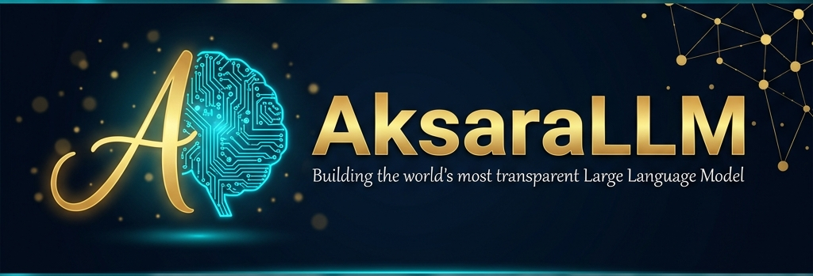

<p align="center">
  
</p>

<h1 align="center">AksaraLLM</h1>

<p align="center">
  <strong>Building the world's most transparent Large Language Model — 100% open source.</strong>
</p>

<p align="center">
  <a href="https://discord.gg/aksarallm"></a>
  <a href="https://twitter.com/aksaraLLM"></a>
  <a href="https://huggingface.co/aksaraLLM"></a>
  <a href="https://github.com/aksaraLLM"></a>
</p>

---

## 🌏 What is AksaraLLM?

**AksaraLLM** is a global community-driven initiative to build a truly open-source Large Language Model. Unlike "open-weight" releases where only model weights are published, we open-source **everything**:

| What We Open | Description |
|---|---|
| 🧠 **Model Weights** | Full model checkpoints in multiple formats |
| 📊 **Training Data** | Complete dataset composition with provenance |
| 💻 **Training Code** | Full distributed training pipeline |
| 🔧 **Tokenizer** | Custom multilingual tokenizer |
| 📏 **Evaluation** | Benchmark suite and results |
| 📝 **Methodology** | RFCs, decisions, training logs — everything |

> *"Aksara"* (अक्षर) means "letter/script" in Sanskrit-derived languages across Southeast Asia — representing our commitment to making AI literacy and language technology accessible to all.

## 🎯 Mission

1. **True Open Source** — Not just open weights. Every line of code, every byte of data, every decision documented.
2. **Multilingual First** — Strong performance across languages, with emphasis on underrepresented Southeast Asian languages.
3. **Community Owned** — No single corporate entity controls this. Built by the community, for the community.
4. **Reproducible Science** — Anyone should be able to reproduce our results from scratch.

## 📦 Our Repositories

| Repository | Description | Status |
|---|---|---|
| [`AksaraLLM`](https://github.com/aksaraLLM/aksaraLLM) | Model architecture & inference | 🚧 In Progress |
| [`aksara-data`](https://github.com/aksaraLLM/aksara-data) | Data curation pipeline | 🚧 In Progress |
| [`aksara-train`](https://github.com/aksaraLLM/aksara-train) | Distributed training code | 🚧 In Progress |
| [`aksara-eval`](https://github.com/aksaraLLM/aksara-eval) | Evaluation & benchmarks | 📋 Planned |
| [`aksara-tokenizer`](https://github.com/aksaraLLM/aksara-tokenizer) | Custom multilingual tokenizer | 🚧 In Progress |
| [`community`](https://github.com/aksaraLLM/community) | Governance, RFCs, meeting notes | 🚧 In Progress |

## 🗺️ Roadmap

```
Phase 1 (Month 1) ██░░░░░░░░ Foundation & Team
Phase 2 (Month 2) ░░██░░░░░░ Data Pipeline
Phase 3 (Month 3) ░░░░██░░░░ Small-Scale Training
Phase 4 (Month 4) ░░░░░░██░░ Main Model Training (7B)
Phase 5 (Month 5) ░░░░░░░░██ Post-Training & Alignment
Phase 6 (Month 6) ░░░░░░░░░░██ Release & Community
```

**Target:** AksaraLLM-7B — a competitive 7B parameter model trained on 1-2T tokens.

## 🤝 How to Contribute

We welcome contributors of **all skill levels** from around the world!

### Roles We Need
- 🧠 **ML Researchers** — Architecture design, scaling laws
- 💻 **ML Engineers** — Training pipeline, optimization
- 📊 **Data Engineers** — Data acquisition, cleaning, filtering
- 🔧 **Infrastructure** — Cluster management, DevOps
- 📝 **Technical Writers** — Documentation, blog posts
- 🌍 **Translators** — Multilingual data curation
- 🎨 **Designers** — Website, branding, visualization
- 📢 **Community Managers** — Outreach, social media

### Getting Started
1. **Join our [Discord](https://discord.gg/aksarallm)** — Introduce yourself!
2. **Read our [Contributing Guide](https://github.com/aksaraLLM/community/blob/main/CONTRIBUTING.md)**
3. **Check [Good First Issues](https://github.com/orgs/aksaraLLM/projects)** across all repos
4. **Read our [RFCs](https://github.com/aksaraLLM/community/tree/main/rfcs)** and join discussions

### GPU Donations
If you have spare GPU compute, we'd love your help! See our [GPU Donation Guide](https://github.com/aksaraLLM/community/blob/main/GPU_DONATIONS.md) for details.

## 📜 License

All AksaraLLM code is released under the **Apache License 2.0**. Models are released under permissive licenses that allow commercial use.

## 🫶 Acknowledgments

AksaraLLM is inspired by the work of [EleutherAI](https://www.eleuther.ai/), [BigScience (BLOOM)](https://bigscience.huggingface.co/), [AI2 (OLMo)](https://allenai.org/olmo), and countless other open-source AI initiatives. We stand on the shoulders of giants.

---

<p align="center">
  <strong>Built with ❤️ by the global open-source community</strong>
</p>
